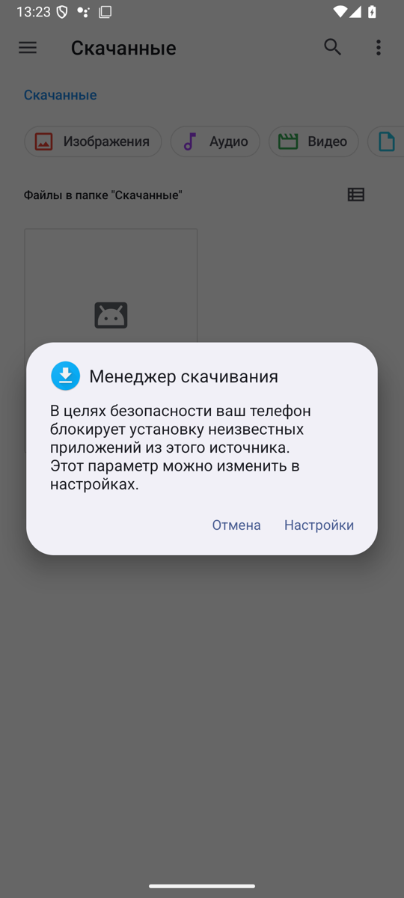
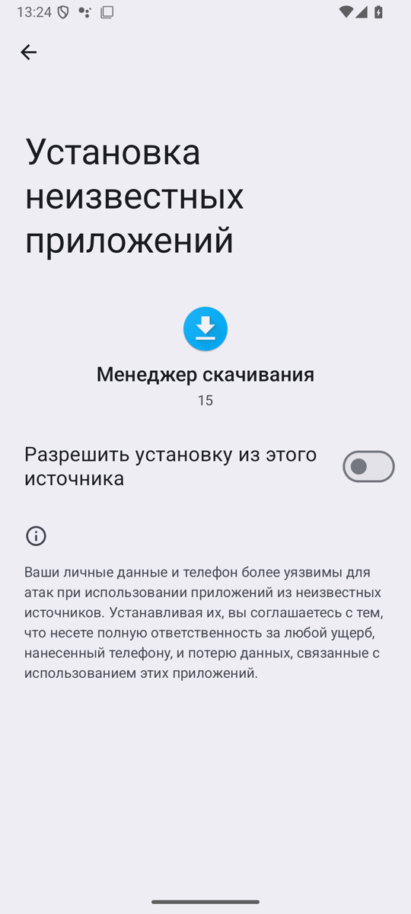
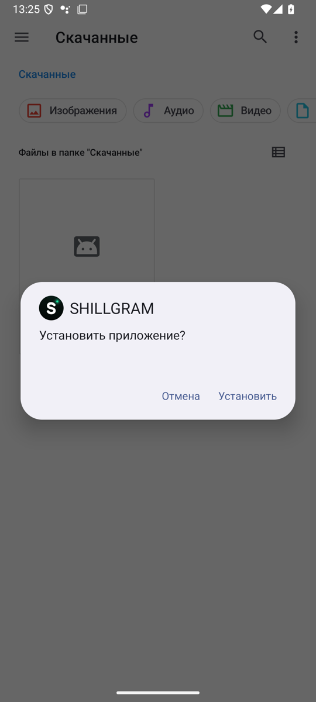
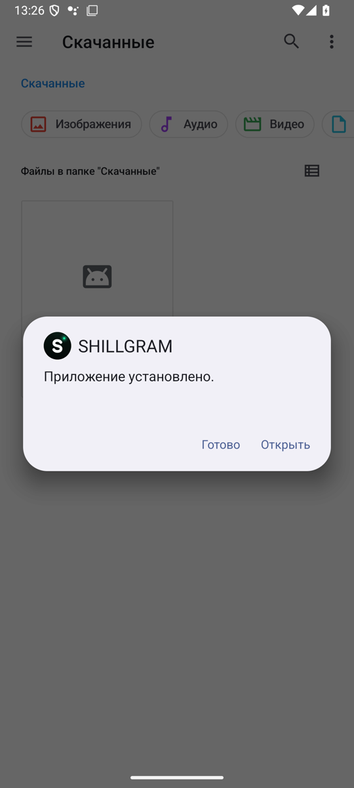
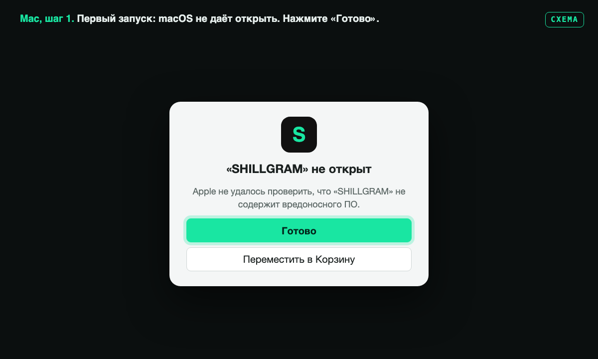
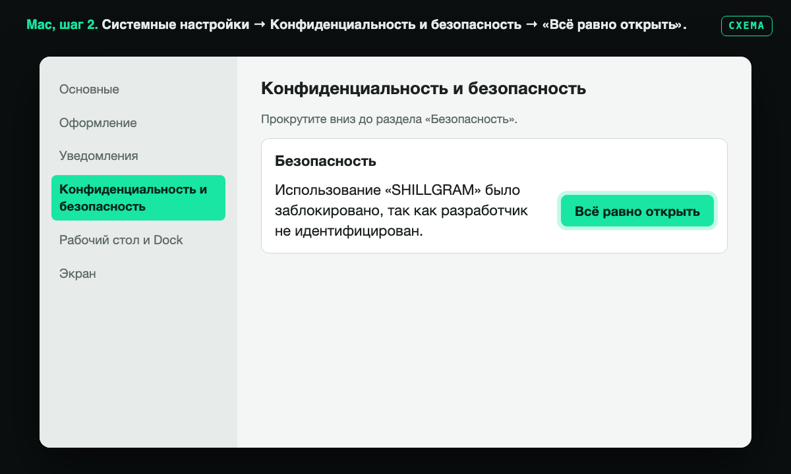
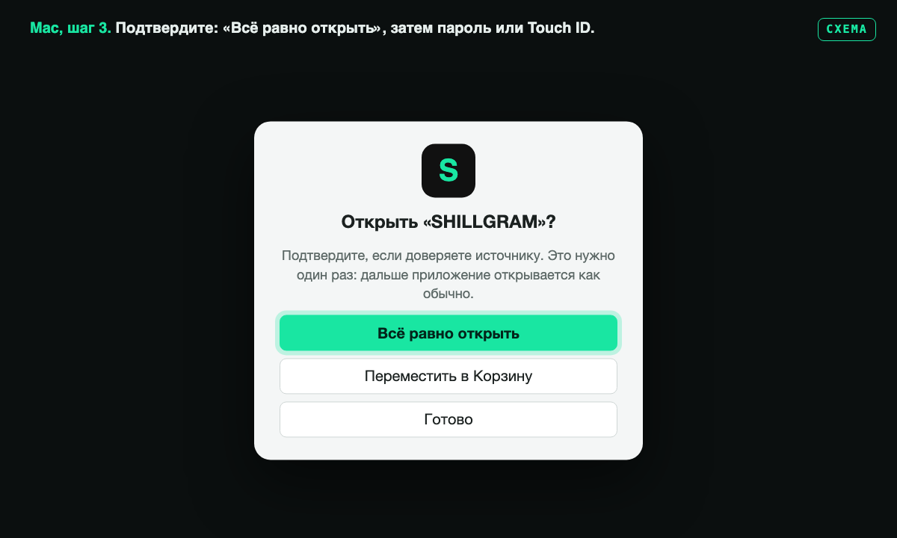
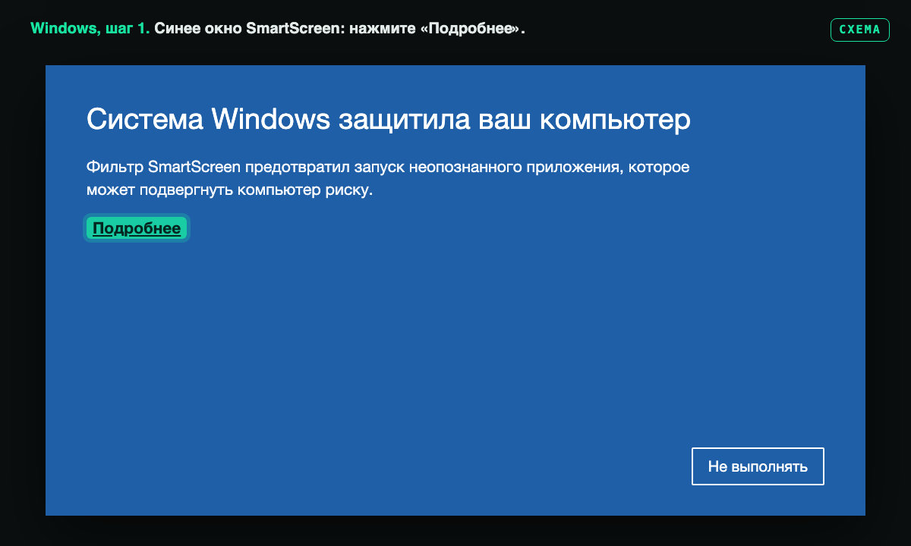
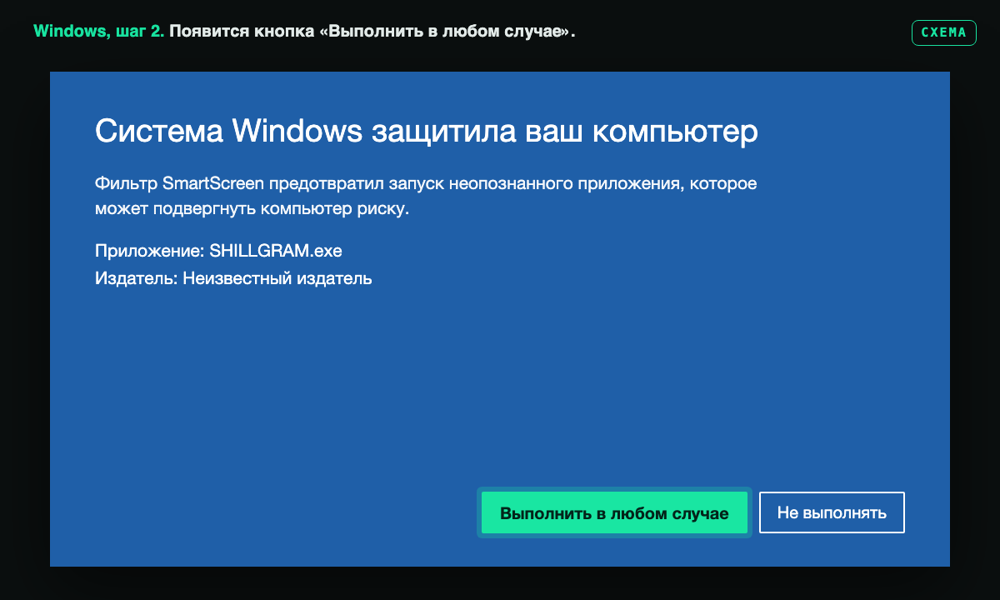

# Как установить SHILLGRAM

Скачайте файл для своего устройства из [последнего релиза](https://github.com/audit0/SHILLGRAM/releases/latest), установите и запустите. При первом запуске нажмите «Получить 3 дня бесплатно» и войдите в Telegram как обычно.

| Устройство | Файл |
|---|---|
| Android | `SHILLGRAM-…-Android-arm64-v8a.apk`, если не уверены — `…-universal.apk` |
| Mac (M1 и новее, macOS 12+) | `SHILLGRAM-…-macOS-arm64.zip` |
| Windows 10/11 (64 бит) | `SHILLGRAM-…-Windows-x64.zip` |
| Linux (x86-64) | `SHILLGRAM-…-Linux-x64.tar.xz` |
| iPhone (бета) | `SHILLGRAM-…-iOS.ipa`, установка — в [описании релиза 1.0](https://github.com/audit0/SHILLGRAM/releases/tag/v1.0) |

**Почему система предупреждает.** SHILLGRAM распространяется не через App Store и Google Play, а сборки пока не подписаны платным сертификатом Apple и Microsoft. Поэтому macOS, Windows и Android один раз спрашивают, доверяете ли вы источнику. Исходный код открыт в этом репозитории, а настоящий файл можно сверить по контрольной сумме (ниже).

Начиная с версии 1.1 приложение само сообщает о новых версиях, и обновление ставится поверх старого. Чаты и настройки сохраняются.

---

## Android

Скачайте APK в браузере или в Telegram и откройте его.

**1.** Android предупредит, что установка из этого источника заблокирована. Нажмите «Настройки».



**2.** Включите «Разрешить установку из этого источника» и вернитесь назад. Источником будет приложение, из которого вы открыли файл: браузер, Telegram или «Файлы».



**3.** Нажмите «Установить».



**4.** Готово, нажмите «Открыть».



Если Google Play Защита предложит проверить приложение, можно выбрать «Всё равно установить». Новые версии APK ставятся поверх, удалять старую не нужно.

## Mac

Распакуйте архив двойным щелчком и перенесите `SHILLGRAM` в «Программы». Сборка не нотаризована Apple, поэтому первый запуск нужно разрешить один раз. На картинках ниже схемы окон, а не снимки экрана: на вашей версии macOS надписи могут немного отличаться.

**1.** Откройте SHILLGRAM. macOS скажет, что не может проверить приложение. Нажмите «Готово», не «Переместить в Корзину».



**2.** Откройте «Системные настройки» → «Конфиденциальность и безопасность», прокрутите вниз до раздела «Безопасность» и нажмите «Всё равно открыть» рядом со строкой про SHILLGRAM. Кнопка появляется только после попытки открыть приложение и держится около часа.



**3.** Подтвердите «Всё равно открыть» и введите пароль Mac или приложите палец к Touch ID. Дальше SHILLGRAM открывается как обычно.



Обновление: замените старый SHILLGRAM в «Программах» новым.

## Windows

Распакуйте архив в любую папку, например в «Документы», и запустите `SHILLGRAM.exe`. Файл `xray.exe` рядом — ядро SHILLVPN, держите их вместе. На картинках схемы окна SmartScreen, а не снимки экрана.

**1.** Если появится синее окно «Система Windows защитила ваш компьютер», нажмите «Подробнее».



**2.** Нажмите «Выполнить в любом случае». Это нужно один раз.



Обновление: закройте SHILLGRAM и распакуйте новый архив поверх старой папки с заменой файлов.

## Linux

```bash
tar -xJf SHILLGRAM-*-Linux-x64.tar.xz
./SHILLGRAM/SHILLGRAM
```

Файл `xray` рядом с программой — ядро SHILLVPN, держите их в одной папке. Обновление: закройте SHILLGRAM и распакуйте новый архив поверх.

---

## Проверить, что файл настоящий

У каждого файла в релизе есть контрольная сумма SHA-256: в файлах `*.sha256` и `SHA256SUMS*.txt`. Посчитайте сумму у себя и сравните с ней.

- Mac: `shasum -a 256 SHILLGRAM-…-macOS-arm64.zip`
- Windows (PowerShell): `Get-FileHash .\SHILLGRAM-…-Windows-x64.zip`
- Linux: `sha256sum SHILLGRAM-…-Linux-x64.tar.xz`

Если суммы не совпадают, не открывайте файл и напишите нам.

Скачивайте SHILLGRAM только со страницы релизов этого репозитория. Ссылки на неё публикует канал [@SHILGRAM](https://t.me/SHILGRAM).

Вопросы и ошибки: [t.me/SHILLSUP](https://t.me/SHILLSUP)
